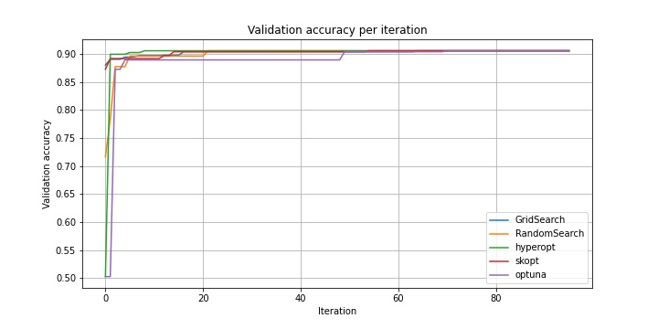
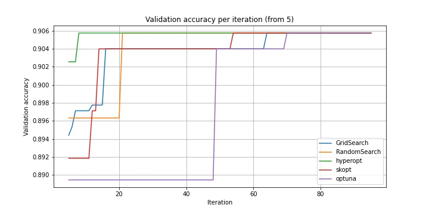
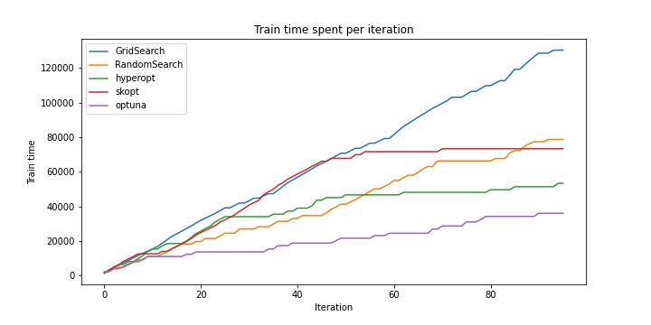

# Hyperparameter optimization

Code for habr article on hyperparameter optimization methods review. Also I considered hyperopt, skopt and optuna frameworks on sentiment-analysis NLP task.

## Data
[Large Movie Review Dataset](https://ai.stanford.edu/~amaas/data/sentiment/aclImdb_v1.tar.gz)

[FastText word embeddings](https://dl.fbaipublicfiles.com/fasttext/vectors-english/wiki-news-300d-1M.vec.zip)

[Train and test results only (257kB)](https://drive.google.com/file/d/1leS0eFFXTo5boPDt269RofsmuMRswstl/view?usp=sharing)

## Model and parameters

[torch.nn.LSTM-based model](https://github.com/twelveth/hyperparameter_optimization/blob/main/src/lstm_model.py) with parameters grid:

```
params_grid = {
    'hidden_size': [64, 128, 256, 512],
    'num_layers': [1, 2],
    'dropout': [0.5],
    'bidirectional': [True, False],
    'batch_size': [64, 256],
    'lr': [1e-3, 1e-2, 1e-1]
}
```

## Results

| Optimizer | hidden_size | num_layers | bidirectional | batch_size | lr | Val loss | Val accuracy | Test accuracy | Time (s) |
| -------- | -------- | -------- | -------- | -------- | -------- | -------- | -------- | -------- | -------- |
| GridSearch | 256 | 2 | + | 256 | 0.01 | 0.63 | 0.906 | 0.897 | 130357 |
| RandomSearch | 256 | 2 | + | 256 | 0.01 | 0.63 | 0.906 | 0.897 | 78777 |
| hyperopt | 256 | 2 | + | 256 | 0.01 | 0.63 | 0.906 | 0.897 | 68920 |
| scikit-optimize (LCB) | 256 | 2 | + | 256 | 0.01 | 0.63 | 0.906 | 0.897 | 73423 |
| scikit-optimize (gp_hedge) | 64 | 2 | + | 256 | 0.01 | 0.69 | 0.904 | 0.900 | 61869 |
| optuna | 256 | 2 | + | 256 | 0.01 | 0.63 | 0.906 | 0.897 | 40681 |





## How to reproduce

In my experiments I used python==3.6.6. Needed packages can be installed via `pip install -r requirements.txt`.

- If you want just to play with obtained train/val/test accuracies, losses and times, you need to unpack "Train and test results only" to your project directory. Then you may use hyperparams.ipynb.

- If you want retrain all the models and run the whole pipeline, you need to unpack the dataset archive to 'data' in your project directory, unpack embeddings just to your project directory. Then run `python3 train_all.py <n_epochs> <device>`. When all the models will be trained, you may use hyperparams.ipynb.
